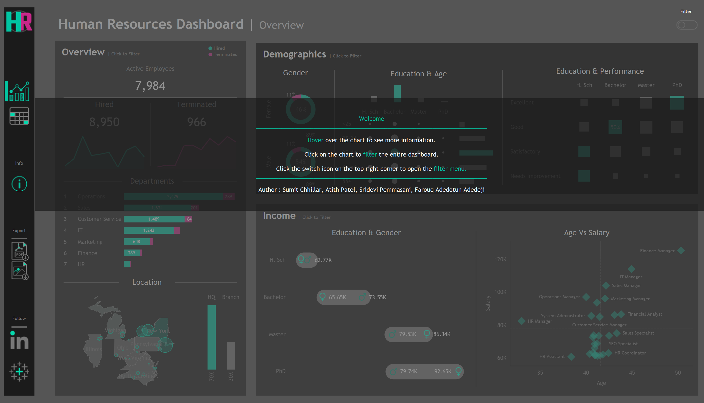

# 📊 Advanced HR Analytics Dashboard

Welcome to my **Human Resources Analytics Dashboard**, built using **Tableau**, designed to help HR teams and leadership make informed, data-driven decisions.

---

## 🚀 Project Objective
The goal of this project is to visualize and analyze employee data to uncover insights related to:
- Workforce demographics
- Salary distributions
- Performance metrics
- Employment trends
- Geographic spread of talent

---

## 📌 Features & Insights
- **Employee Directory:** Searchable list of employees with filters for department, location, salary, and tenure.
- **Demographics Breakdown:** Age, gender, and education levels.
- **Income Analysis:** Salary comparisons by education and gender.
- **Performance Metrics:** Correlation of education level with performance ratings.
- **Hiring & Termination Trends:** Department-wise trends over time.
- **Geographical Visualization:** Employee distribution across US states.
- **Age vs Salary Correlation:** Identify roles with the best compensation trajectories.

---

## 🛠️ Tech Stack
- **Visualization:** Tableau
- **Data Analytics:** Excel preprocessing
- **Design:** Interactive Dashboards & Storytelling with Data

---

## 📷 Screenshots
| Employee Directory  | Overall HR Overview |
|:-------------------:|:-------------------:|
|  |  |

| Info Panel |
|:----------:|
|  |

---

## 📈 Potential Use Cases
- HR Strategic Planning
- Salary & Compensation Analysis
- Performance & Education Correlation Studies
- Diversity & Inclusion Tracking

---

## 🤝 Let's Connect
If you'd like to collaborate, have feedback, or want to discuss data visualization, feel free to reach out:
- [LinkedIn](https://www.linkedin.com/in/sumit-chhillar-020a36323/)
- [GitHub](https://github.com/Sumit170694/HR-Analysis)

---

## ⭐ Show your support
If you found this project useful, please **star ⭐ the repository** and share your suggestions!

---
